# Physical internet

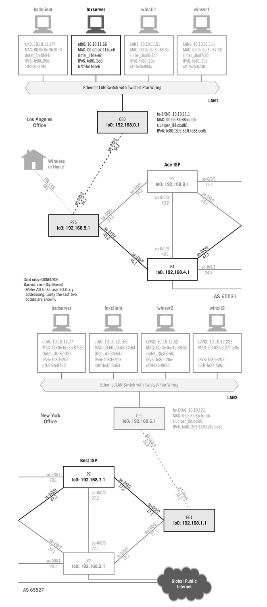

```bash
$ traceroute google.com

traceroute to google.com (142.250.195.238), 30 hops max, 60 byte packets
 1  router.asus.com (192.168.0.1)  0.652 ms  0.730 ms  0.909 ms
 2  10.235.0.1 (10.235.0.1)  2.384 ms  2.690 ms  2.782 ms
 3  broadband.actcorp.in (202.83.20.43)  2.559 ms  2.865 ms  2.958 ms
 4  121.242.109.165.static-bangalore.vsnl.net.in (121.242.109.165)  3.210 ms  3.193 ms  3.177 ms
 5  172.31.167.58 (172.31.167.58)  9.294 ms  13.619 ms  13.603 ms
 6  14.140.100.6.static-vsnl.net.in (14.140.100.6)  9.518 ms  7.316 ms  8.773 ms
 7  115.112.71.65.STDILL-Chennai.vsnl.net.in (115.112.71.65)  9.074 ms  8.065 ms  9.260 ms
 8  121.240.1.50 (121.240.1.50)  8.905 ms  9.111 ms  10.393 ms
 9  108.170.253.113 (108.170.253.113)  12.276 ms  12.575 ms  16.077 ms
10  216.239.56.71 (216.239.56.71)  8.366 ms 142.250.224.7 (142.250.224.7)  8.753 ms  10.148 ms
11  maa03s43-in-f14.1e100.net (142.250.195.238)  8.565 ms  8.436 ms  8.533 ms
```

```bash
$ whois 1e100.net

Registrant Organization: Google Inc.
Registrant State/Province: CA
Registrant Country: US
Registrant Email: Select Request Email Form at https://domains.markmonitor.com/whois/1e100.net
Admin Organization: Google Inc.
Admin State/Province: CA
Admin Country: US
Admin Email: Select Request Email Form at https://domains.markmonitor.com/whois/1e100.net
Tech Organization: Google Inc.
Tech State/Province: CA
Tech Country: US
Tech Email: Select Request Email Form at https://domains.markmonitor.com/whois/1e100.net
Name Server: ns3.google.com
Name Server: ns2.google.com
Name Server: ns1.google.com
Name Server: ns4.google.com
```

# OSI

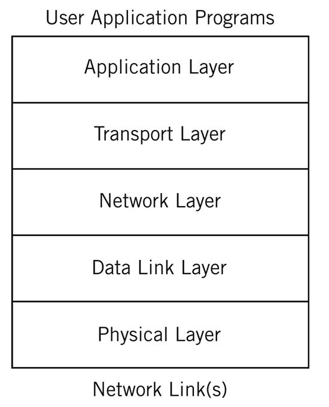

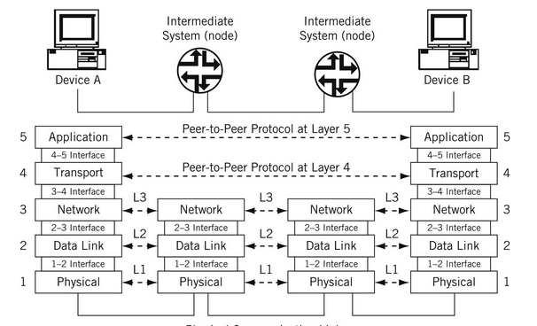

- Physical Layer: Contains all the functions needed to carry the bit stream over a physical medium to another system. topology, LAN, simplex-duplex etc.

- Data Link Layer: Organizes the bit stream into a data unit called a “frame” and delivers the frame to an adjacent system. physical address, crc, MAC, flow control, error control, MAC flooding (adjacent systems delivery)

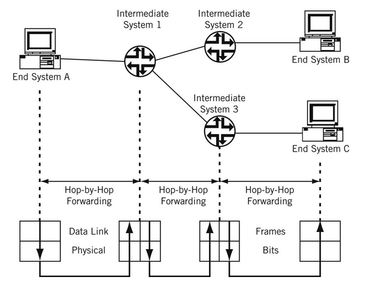

- Network Layer: Delivers data in the form of a packet from source to destination, across as many links as necessary, to non-adjacent systems. TCP/IP, ARP, ICMP (ping), TTL (also flooding) (end to end delivery)

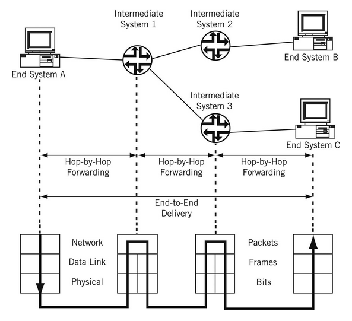

```bash
ifconfig

ip address
```

- Transport Layer: Concerned with process-to-process delivery of information. UDP, TCP, addressing ip+port, connection control, flow control, error control, SYN flood, smurf, UDP flood, TLS, DTLS (kinda), IP spoofing, DTLS reflection/amplification attacks, backpressure, ES-IS, IS-IS, IPsec

- Application (+session, presentation) Layer: Concerned with differences in internal representation, user interfaces, and anything else that the user requires. Named pipe, SOCKS, TLS, SPDY, ASN.1,

<!-- Routers dont parse packets after network layer unless deep packet introspection - e.g. wireshark -->


# ISPs structure

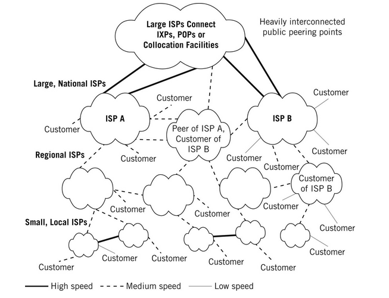

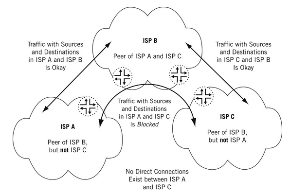

IGPs - Interior routing protocols
- Open Shortest Path First (OSPF)
- Intermediate System-Intermediate System (IS-IS)
- Border Gateway Protocol
  - BGP runs between different autonomous services

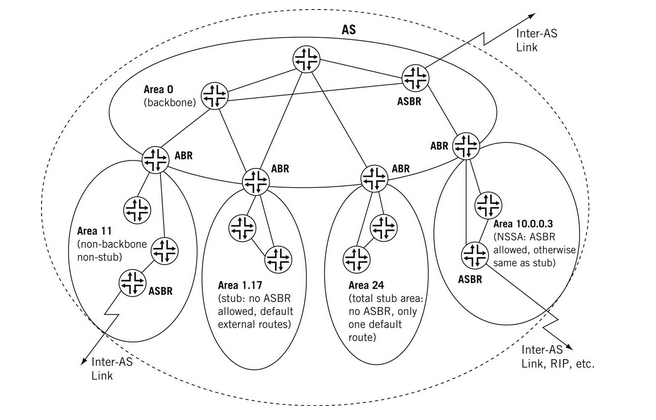

```
exabgp
tabi
pmacct
```

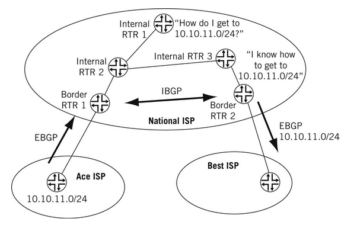

# Physical structure

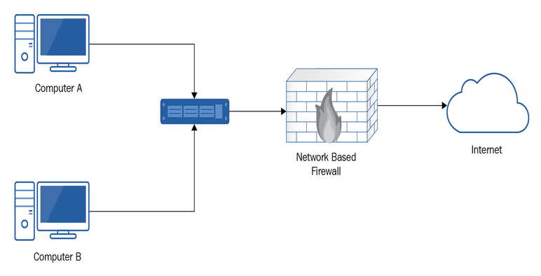

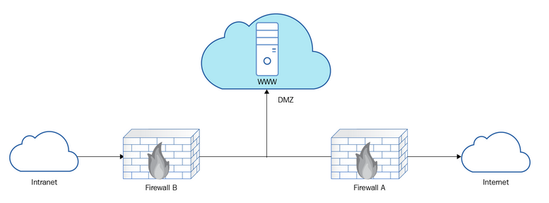

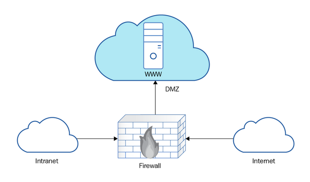

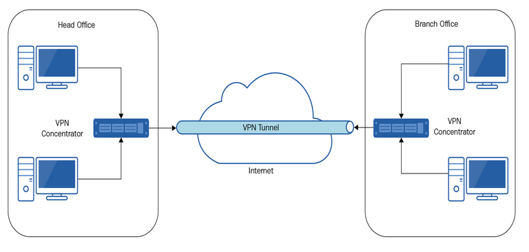

# Devices

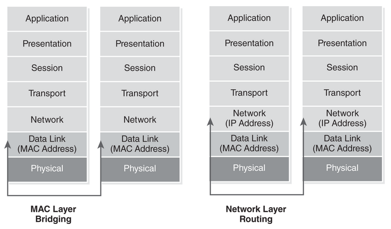

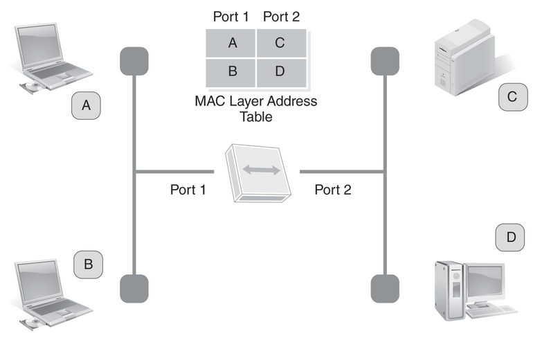
flat topology

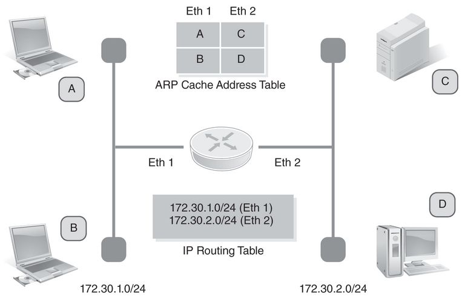

# Routing

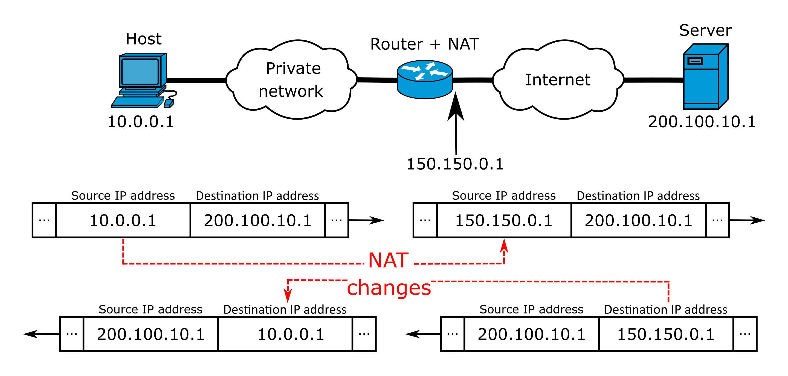

```bash
$ sudo iptables --table nat --list

Chain PREROUTING (policy ACCEPT)
target     prot opt source               destination
DOCKER     all  --  anywhere             anywhere             ADDRTYPE match dst-type LOCAL

Chain INPUT (policy ACCEPT)
target     prot opt source               destination

Chain OUTPUT (policy ACCEPT)
target     prot opt source               destination
DOCKER     all  --  anywhere            !127.0.0.0/8          ADDRTYPE match dst-type LOCAL

Chain POSTROUTING (policy ACCEPT)
target     prot opt source               destination
MASQUERADE  all  --  172.17.0.0/16        anywhere
MASQUERADE  all  --  172.20.0.0/16        anywhere
MASQUERADE  all  --  172.19.0.0/16        anywhere
MASQUERADE  tcp  --  172.19.0.3           172.19.0.3           tcp dpt:https
MASQUERADE  tcp  --  172.19.0.3           172.19.0.3           tcp dpt:http

Chain DOCKER (2 references)
target     prot opt source               destination
RETURN     all  --  anywhere             anywhere
RETURN     all  --  anywhere             anywhere
RETURN     all  --  anywhere             anywhere
DNAT       tcp  --  anywhere             anywhere             tcp dpt:distinct to:172.19.0.3:443
DNAT       tcp  --  anywhere             anywhere             tcp dpt:distinct32 to:172.19.0.3:80
```

# Protocols

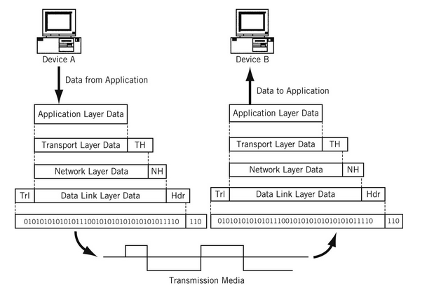

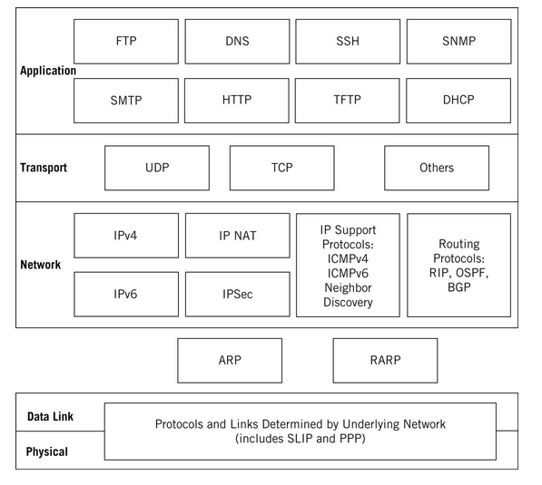

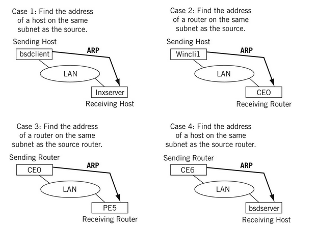

```bash
$ sudo arp-scan --interface=wlp4s0 --localnet

Interface: wlp4s0, type: EN10MB, MAC: 08:71:90:72:2b:80, IPv4: 192.168.0.241
Starting arp-scan 1.9.7 with 256 hosts (https://github.com/royhills/arp-scan)
192.168.0.1	2c:4d:54:1b:9e:08	ASUSTek COMPUTER INC.
192.168.0.102	6c:56:97:a8:27:76	Amazon Technologies Inc.
192.168.0.128	02:42:e1:a8:92:d8	(Unknown: locally administered)
192.168.0.28	ac:84:c6:05:d3:d5	TP-LINK TECHNOLOGIES CO.,LTD.
192.168.0.103	b8:27:eb:d6:10:2d	Raspberry Pi Foundation
192.168.0.103	b8:27:eb:d6:10:2d	Raspberry Pi Foundation (DUP: 2)
192.168.0.51	dc:a6:32:d4:8a:2e	Raspberry Pi Trading Ltd
192.168.0.51	dc:a6:32:d4:8a:2e	Raspberry Pi Trading Ltd (DUP: 2)
192.168.0.185	04:c8:07:32:57:0c	Xiaomi Communications Co Ltd
192.168.0.204	04:d1:3a:bd:d3:35	Xiaomi Communications Co Ltd

12 packets received by filter, 0 packets dropped by kernel
Ending arp-scan 1.9.7: 256 hosts scanned in 1.962 seconds (130.48 hosts/sec). 10 responded
```

```bash
# TCP flow control window size
$ sudo sysctl -n net.core.rmem_default
212992

$ sudo sysctl -n net.ipv4.tcp_rmem
4096	131072	6291456

echo 'net.core.wmem_max=4194304' >> /etc/sysctl.conf
echo 'net.core.rmem_max=12582912' >> /etc/sysctl.conf
echo 'net.ipv4.tcp_rmem = 4096 87380 4194304' >> /etc/sysctl.conf
echo 'net.ipv4.tcp_wmem = 4096 87380 4194304' >> /etc/sysctl.conf
sysctl -p
```

```bash
# Routing tables
$ netstat -nr

Kernel IP routing table
Destination     Gateway         Genmask         Flags   MSS Window  irtt Iface
0.0.0.0         192.168.0.1     0.0.0.0         UG        0 0          0 wlp4s0
172.17.0.0      0.0.0.0         255.255.0.0     U         0 0          0 docker0
172.19.0.0      0.0.0.0         255.255.0.0     U         0 0          0 br-4f32afc8a10a
172.20.0.0      0.0.0.0         255.255.0.0     U         0 0          0 br-b7f65c12dc95
192.168.0.0     0.0.0.0         255.255.255.0   U         0 0          0 wlp4s0
```

## TLS

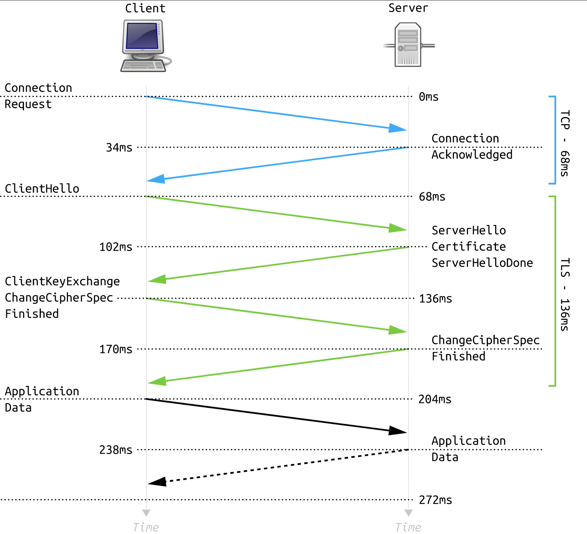

## SNMP

```bash
adsnmp - tool to brute force password attack if snmp is enabled in router
```
